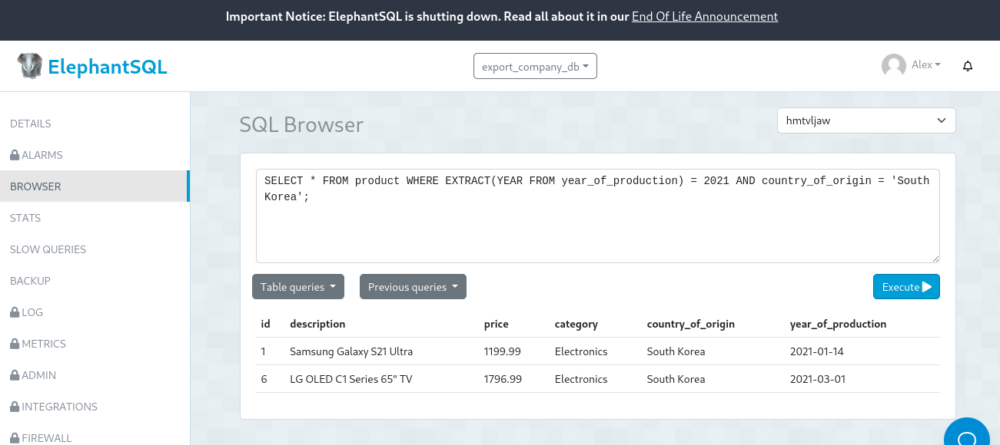

# Tarea TAS7 - Events

by: Alex Calle

## 1. Contar el número de productos de una categoría específica

**Sentencia**

SELECT COUNT(\*) FROM product WHERE category = 'Electronics';

**Captura**

## 2. Contar el número de clientes en una ciudad específica

**Sentencia**

SELECT COUNT(\*) FROM client WHERE city = 'London';

**Captura**

## 3. Contar el número de productos cuyo precio está dentro de un rango específico

**Sentencia**

SELECT COUNT(\*) FROM product WHERE price BETWEEN 50 AND 500;

**Captura**

## 4. Seleccionar clientes que viven en una ciudad específica y tienen un tipo de cliente específico

**Sentencia**

SELECT \* FROM client WHERE city = 'New York' AND type_of_client = 'Premium';

**Captura**

## 5. Seleccionar productos que pertenecen a una categoría específica y cuyo precio está por encima de un valor específico

**Sentencia**

SELECT \* FROM product WHERE category = 'Electronics' AND price > 1000;

**Captura**

## 6. Seleccionar productos que fueron producidos en un año específico y en un país de origen específico

**Sentencia**

SELECT \* FROM product WHERE EXTRACT(YEAR FROM year_of_production) = 2021 AND country_of_origin = 'South Korea';

**Captura**

## 7. Seleccionar clientes cuyo nombre completo comience con 'J'

**Sentencia**

SELECT \* FROM client WHERE fullname LIKE 'J%';

**Captura**

## 8. Seleccionar clientes cuya ciudad contenga la letra 'a'

**Sentencia**

SELECT \* FROM client WHERE city LIKE '%a%';

**Captura**

